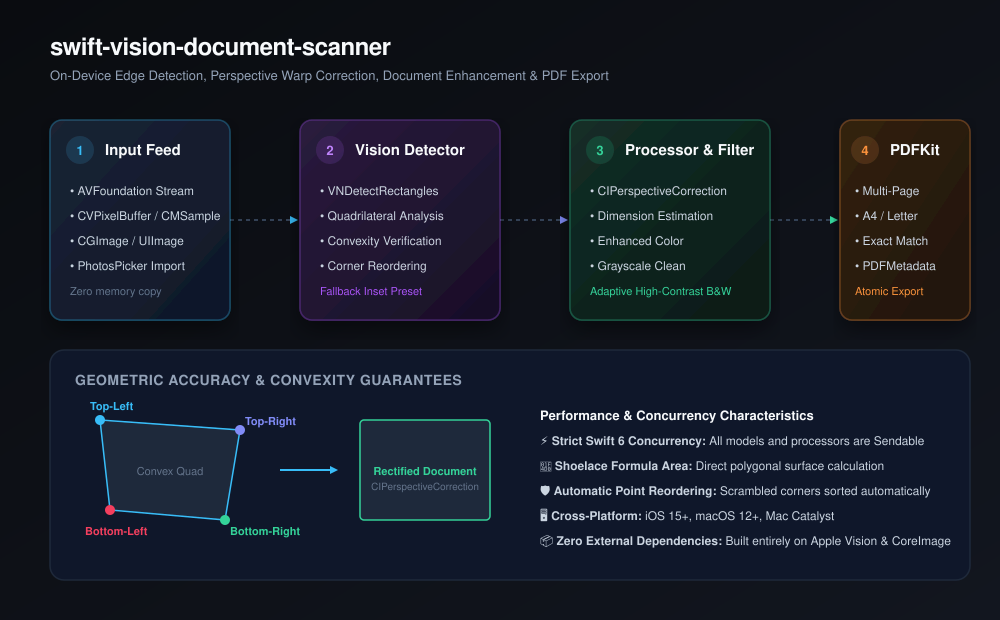

# swift-vision-document-scanner

[](https://github.com/nilkanthdesai76/swift-vision-document-scanner/actions/workflows/ci.yml)
[](https://swift.org)
[](https://developer.apple.com)
[](LICENSE)

A high-performance, modern Swift package for on-device document boundary detection, perspective warp rectification, document enhancement filtering, and multi-page vector PDF generation built on Apple's **Vision**, **CoreImage**, and **PDFKit** frameworks.

<p align="center">
  
</p>

---

## ⚡ Highlights

- 🔍 **Real-Time Edge Detection**: Built on Apple Vision `VNDetectRectanglesRequest` with tunable quadrature tolerance, confidence thresholds, and aspect ratios.
- 📐 **Convex Polygon Math**: Automatic corner sorting (`[TL, TR, BR, BL]`), Shoelace formula area computation, centroid discovery, and bounding box normalization.
- 🔄 **Perspective Warp Correction**: Rectifies skewed document photos into upright, rectilinear flat scans using hardware-accelerated CoreImage `CIPerspectiveCorrection`.
- 🎨 **Document Enhancement Filters**:
  - `original`: Unfiltered perspective-corrected scan.
  - `colorEnhanced`: Dynamic contrast, saturation, and exposure leveling for colored receipts and certificates.
  - `grayscale`: Neutral tone curve eliminating chromatic aberration and yellow paper cast.
  - `blackAndWhite`: Adaptive high-contrast document thresholding for crisp, ink-black text legibility.
- 📄 **Multi-Page PDF Compiler**: Compiles scanned pages directly into clean, vector-quality PDF documents with support for **A4**, **US Letter**, or **exact aspect ratio** presets.
- 🛡️ **Zero External Dependencies**: 100% native Apple SDKs (`Vision`, `CoreImage`, `PDFKit`, `CoreGraphics`).
- 🧵 **Swift 6 Concurrency**: Full `Sendable` guarantees across all models, detectors, processors, and exporters.

---

## 📦 Installation

Add `swift-vision-document-scanner` to your project via Swift Package Manager:

### In `Package.swift`:
```swift
dependencies: [
    .package(url: "https://github.com/nilkanthdesai76/swift-vision-document-scanner.git", from: "1.0.0")
]
```

### In Xcode:
1. Go to **File &rarr; Add Package Dependencies...**
2. Enter the repository URL: `https://github.com/nilkanthdesai76/swift-vision-document-scanner`
3. Select version rules and add to your target.

---

## 🚀 Quick Start

### 1. One-Liner Scanning Facade

```swift
import VisionDocumentScanner

// Scan, rectify, and enhance in a single call
if let result = try await VisionDocumentScanner.scan(
    image: sourceCGImage,
    configuration: .default,
    filter: .blackAndWhite
) {
    let quad = result.quadrilateral
    let scannedImage = result.processedImage
    print("Document scanned successfully! Area: \(quad.area)")
}
```

---

### 2. Step-by-Step Custom Pipeline

#### Step A: Detect Document Boundary
```swift
import VisionDocumentScanner

let detector = DocumentDetector.shared

// Detect quadrilateral in image (returns nil if no valid edges found)
let detectedQuad = try await detector.detect(
    in: sourceCGImage,
    configuration: .default,
    normalized: false
)

// Fall back to a standard centered margin if edge detection fails
let finalQuad = detectedQuad ?? detector.fallback(
    for: CGSize(width: sourceCGImage.width, height: sourceCGImage.height)
)
```

#### Step B: Rectify Perspective & Apply Filters
```swift
let processor = DocumentProcessor.shared

// Rectify perspective skew and enhance ink clarity
guard let processedCGImage = processor.process(
    image: sourceCGImage,
    quadrilateral: finalQuad,
    filter: .colorEnhanced
) else {
    fatalError("Failed to rectify document")
}
```

#### Step C: Compile into Multi-Page PDF
```swift
let compiler = PDFCompiler.shared

let pdfData = compiler.compile(
    images: [page1CGImage, page2CGImage],
    pageSize: .a4(margin: 20.0),
    metadata: PDFMetadata(
        title: "Q4 Financial Report",
        author: "Mobile Scanner",
        subject: "Accounting Scans"
    )
)

// Or write directly to file:
try compiler.write(
    images: [page1CGImage, page2CGImage],
    to: destinationFileURL,
    pageSize: .usLetter(margin: 18.0)
)
```

---

## 📐 Quadrilateral Geometry Utilities

```swift
// Automatically sort scrambled points into [Top-Left, Top-Right, Bottom-Right, Bottom-Left]
let quad = Quadrilateral.ordered(from: [pointC, pointA, pointD, pointB])

// Verify geometric validity
if quad.isConvex {
    print("Valid quadrilateral with area: \(quad.area)")
}

// Convert coordinates between pixel and unit space
let normalizedQuad = quad.normalized(for: imageSize)
let pixelQuad = normalizedQuad.scaled(to: imageSize)
```

---

## ⚙️ Configuration Options

| Option | Type | Default | Description |
| :--- | :---: | :---: | :--- |
| `minimumConfidence` | `Float` | `0.2` | Minimum Vision confidence threshold for edge detection. |
| `minimumAspectRatio` | `Float` | `0.2` | Minimum width / height aspect ratio of document. |
| `maximumAspectRatio` | `Float` | `1.0` | Maximum width / height aspect ratio of document. |
| `minimumSize` | `Float` | `0.15` | Minimum document size relative to image dimensions. |
| `quadratureTolerance` | `Float` | `30.0` | Angle tolerance in degrees from 90° corners. |
| `fallbackInsetPercentage` | `CGFloat` | `0.08` | Margin inset percentage (8%) used when fallback is triggered. |

---

## 📄 License

This package is licensed under the [MIT License](LICENSE).
